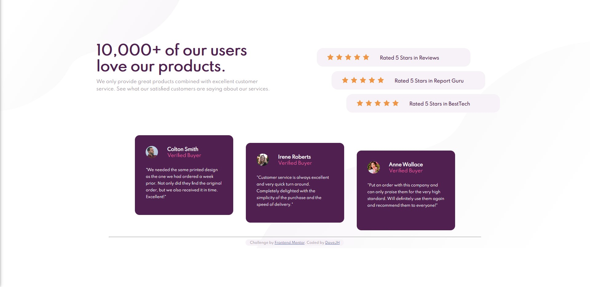

# Frontend Mentor - Social proof section solution

This is a solution to the [Social proof section challenge on Frontend Mentor](https://www.frontendmentor.io/challenges/social-proof-section-6e0qTv_bA). Frontend Mentor challenges help you improve your coding skills by building realistic projects. 

## Table of contents

- [Overview](#overview)
  - [The challenge](#the-challenge)
  - [Screenshot](#screenshot)
  - [Links](#links)
- [My process](#my-process)
  - [Built with](#built-with)
  - [What I learned](#what-i-learned)
  - [Continued development](#continued-development)
- [Author](#author)

## Overview

### The challenge

Users should be able to:

- View the optimal layout for the section depending on their device's screen size

### Screenshot

### Links

- Solution URL: [Here](https://github.com/DaveyJH/social-proof)
- Live Site URL: [Here](https://daveyjh.github.io/social-proof/)

## My process

### Built with

- VS Code
- CSS/HTML only
- Mobile-first design process

### What I learned

I learned about the flex property and attributes.

I also learned that an iPhone XR does NOT work with these sizes!  Many hours of headbanging later.

### Continued development

- I still have some problems copying the text accurately with the given font-weight values.  In particular, I am struggling to get text to resize within its containing element.  I don't know if this is possible in CSS and HTML alone.

## Author

- Website - [LinkedIn](https://www.linkedin.com/in/davejhorrocks)
- Frontend Mentor - [@DaveyJH](https://www.frontendmentor.io/profile/DaveyJH)

